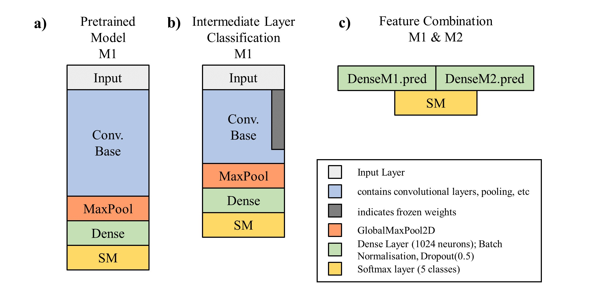
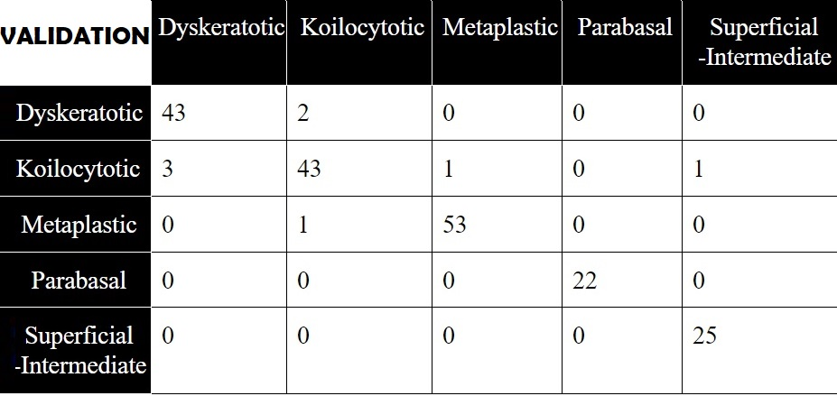

# Deep Cervical Cancer: Cervical Cancer Classification using Deep Learning
### Overview 
A Deep learning framework for cervical cancer classification on the SIPakMed dataset, to allow improved accuracy for PAP smear test evaluation and cancer prognosis 
<table style="border:0px">
   <tr>
       <td></td>
   </tr>
</table>

### Brief Summary
As part of an ETH project a deep learning framework is developed for cervical cancer detection and classification based on microscopics images of cells from PAP-test smear. The purpose of this project is to provide a helpful tool for doctors to rapidly detect if a patient has developed or is in danger of developing cervical cancer.Simply stated, it consitutes a rapid tool for detection and prognosis of cervical cancer for female patients. 

### Dataset
The model will be trained on the [SIPakMed](https://www.researchgate.net/figure/The-boundaries-of-the-cytoplasm-and-the-nucleus-of-each-cell-in-images-of-cell-clusters_fig1_327995161) which is a new Dataset for Feature and Image Based Classification of Normal and Pathological Cervical Cells in Pap Smear Images . The dataset can be downloaded [here](http://www.cs.uoi.gr/~marina/sipakmed.html)
The dataset consists of 996 cluster cell images of Pap smear slides (whole slide images) and has 5 cervical cell classification categories; 
a) Dyskeratotic 
b) Koilocytotic
c) Metaplastic
d) Parabasal
e) Superficial-Intermediate. Overall, this project focuses on a 5 class categorical classification based on whole slide microscopic cell images (not just cropped cell images, but whole slided)


### Procedure
1. Download the SIPakMed dataset

2. The SIPakMed dataset structure needs to be similar to the structure shown below. Use the "implementation_DatasetDivision.py" to reform the SIPakMed dataset structure to the desired dataset structure, with training_size = 0.6, validation_size=0.2 and testing_size=0.2:

- **SIPakMed Dataset**
  ```
  sipakmed
  ├── train
  │   ├── im_Dyskertotic
  │   ├── im_Koilocytotic 
  │   ├── im_Metaplastic 
  │   ├── im_Parabasal  
  │   └── im_Superficial-Intermediate
  ├── val
  │   ├── im_Dyskertotic
  │   ├── im_Koilocytotic 
  │   ├── im_Metaplastic 
  │   ├── im_Parabasal  
  │   └── im_Superficial-Intermediate
  ├── test
  │   ├── im_Dyskertotic
  │   ├── im_Koilocytotic 
  │   ├── im_Metaplastic 
  │   ├── im_Parabasal  
  │   └── im_Superficial-Intermediate
  └── models
  ```
3. Install the "fastai" library and all its dependencies, as well as the torch library(pytorch project)

4. To train the ResNet50 pretrained network on the SIPakMed dataset use the "R50.py". Initially specificy in the file, the path to the SIPakMed (Formatted) dataset---->"path_folder". Then choose appropriate hyperparameters (Epoch = 50 , Batch = 10 , Learning rate = 0.01) and start training

5. After training is completed the model weights are saved and the whole model is exported. You can specify beforehand in the "R50.py", the path to the storage location to which you want the model weights(.pth) and the whole model(.pkl) to be saved

6. In case you have trained your model up to a certain checkpoint and saved it, you can reload the model weigths by specifying the path to the model weights file(.pth)  ---> "model_path" variable in "R50.py"

7. After completing a simple training on the SIPakMed (Formatted) dataset, the results can be further analyzed with the aid of an inference file "Inference_FastAI.py". The inference file will load the model pickle file (.pkl) and will perform classification on any given dataset. It will predict any sample microscopic cell image. The inference file, is set up to evaluate the performance of the model on the testing dataset from the SIPakMed. However it can be carried out on any set of images or a single image. The user needs to specify the "test_dataset_path" and the "model_path" with paths to the testset and the model file respectively. The following screenshot shows the output from an inference file.<table style="border:0px">
   <tr>
       <td></td>
   </tr>
</table>The inference file will output the accuracy, recall, precision values and the confusion matrix for the various cell categories. The inference file can be implemented on the vallidation set as well, by changing " test_dataset_path = path_folder/'test' " to  " test_dataset_path = path_folder/'val' "  

## Further training

The main procedure for training a ResNet50 model on the SIPakMed dataset is described above. Nevertheless for improving results, usually further training is required and hence the methods of data augmentation (DA) , triple transfer learning (TTL) and feature combination are used and described below.

**Data Augmentation**

1. For applying data augmentation to the SIPakMed dataset, the "implementation_DataAugmentation_Extension.py" file is executed. Specify in the file the target directory path to the SIPakMed dataset (or any other dataset you want to apply data augmentation). Set the path of the directory through the variable ---> "target_directory"

2. After executing the file "implementation_DataAugmentation_Extension.py", 14 new augmented images will be generated for each individual image of the SIPakMed dataset. The data augmentations carried out include affine transformations, filter response, color channels tweaking and constrast tuning. The generated images are saved automatically in the same location with the original image. As a result the dataset size increases by a factor of 14, assisting the framework with obtaining better results

**Triple Transfer Learning**
TTL (Trisple Transfer Learning) means that the model was trained on the 3 different datasets in total. Initially the model is trained on the Extended DA dataset, which is the formatted SIPakMed dataset after data augmentation has been carried out (procedure described in the above section). After the model training on Extended DA is completed, the new weigths are saved in a .pth file. Afterwards the model is trained on the [Herlev dataset](https://www.researchgate.net/publication/326477913_Clustering_Techniques_on_Pap-smear_Images_for_the_Detection_of_Cervical_Cancer) which is a cervical cell dataset with 7 classification classes; 
a) Superficial Squamus Epithelial
b) Intermediate Squamus Epithelial
c) Columnar Epithelial
d) Mild Dysplasia 
e) Moderate Dysplasia
f) Severe Dysplasia
g) Carcinoma in Situ,
consisting of 916 images of single cells. Because there are more classes to be classified in the Herlev dataset, the output head (softmax layer) needs to be changed to 7 outputs. This is done automatically in the "R50Herlev.py". The weights, after training on the Herlev are saved and again retrieved in preparation for the final training on the SIPakMed dataset. Hence the weights are loaded to the model and the 3rd training is carried out on the SIPakMed dataset and the final model is saved(.pth) and exported(.pkl). The procedure to carry out TTL is described below:

1. Download the Herlev dataset [here](http://mde-lab.aegean.gr/images/stories/docs/smear2005.zip)

2. Make sure that you have all 3 datasets in your main directory. The Extended DA, the Herlev and the SIPakMed (Formatted) dataset

3. Only the 'R50Herlev.py file needs to be executed to succesfully complete the TTL

4. The path to the model weights from training on the Extended DA dataset needs to be specified. Training on Extended DA and saving the weights is no different than training on the SIPakMed (Formatted). With the aid of "R50.py", the model is trained on the Extended DA. Remember that if you want to train on the Extended DA, just change the "path_img" variable in the "R50.py" and specify the path to the Extended DA this time. Then choose the location at which the model weights will be saved (after training on the Extended DA is complete). Now the path (to the model weights location) you chose when training before, will be the path that needs to be specified in the "R50Herlev.py"

5. In the "R50Herlev.py" we need to specify the path to the directory of the Extended DA datset through "previous_model_DA_data_path". Also the path to the model weights (after training on the Extended DA is complete) needs to be specified in the "previous_model_DA". Finally the path to the next dataset (that we will train on) needs to be specified in the "path_img" variable. It is recommended to set it to the Herlev dataset path -----> path_img = Path("path/to/smear2005Format")

6. Then just make sure that the number of output classes is set to 7 and 5 for the Herlev and SIPakMed respectively. The variables "current_classes_of_dataset" and "output_classes_of_next_dataset" need to be set to 7 and 5 respectively. It's very important to set appropriately the number of outputs corresponding to each of your datasets, to avoid any size mismatch in the output softmax layers when loading weights and architecture from one model to another

7. Execute the "R50Herlev.py" after setting appropriate hyperparameters. The final output model will be saved under the path specified by "save_loc" variable in the "LoadWeights.py" file. Both files ("R50Herlev.py", "LoadWeights.py") are needed to succesfully execute R50Herlev.py" file

8. After training is completed, the model is saved(.pth) and exported(.pkl).Once again the model can be loaded to the learner of the inference file for better interpretation and analysis of the results. The inference file prints the accuracy, precision, recall values along with the confusion matrix for the 5 categories


**Feature Combination**
In contrast to the previously mentioned approaches, the following models were coded in Keras. Furthermore the "sklearn" package for performance reports, and "numpy" for various purposes are required. All lbraries and packages need to be downloaded and installed in the system before training. For carrying out the feature combination method, 4 files are required and need to be executed: "K_REPORT_MODELS.py", "K_REPORT_MAIN_R50.py", "K_REPORT_MAIN_VGG.py", "K_REPORT_MAIN_COMB.py". In order to succesfully run the models and obtain the final predictions the following steps are required:
1. Make sure that all 4 files (mentioned above) are located in the same folder or directory

2. Specify the path to the SIPakMed (Formatted) dataset directory in all python files except ""K_REPORT_MODELS.py"

3. Train the 'Intermediate Layer Classification' models based on R50 and VGG16 by running "K_REPORT_MAIN_R50.py" and "K_REPORT_MAIN_VGG.py" respectively. Both files will save the model weights post training as K_R50_T2.h5 and K_VGG_T2.h5 respectively, and output the model performances on the test set

4. Finally, the features extracted from models M1 ("Intermediated Layer Classification based on R50") and M2 ("Intermediate Layer Classification based on VGG16") are combined into a new model and trained by exectuting the "K_REPORT_MAIN_COMB.py". The final model trained with "K_REPORT_MAIN_COMB.py", is depicted in the right corner of the figure below.<table style="border:0px">
   <tr>
       <td></td>
   </tr>
</table>Executing "K_REPORT_MAIN_COMB.py" will output accuracy, confusion matrix and classwise precision and recall values for the final model. Selecting a good seed on line 105 based on validation performance, may be necessary to reach optimal performance


## Best framework
The model with the highest accuracy was obtained by implementing the TTL method. The best performing framework yielded outstanding results with very high accuracy, recall and precision vallues. The confusion matrix obtained with the aid of the inference file is shown below for inference on both the testing and validation set.
<table style="border:0px">
   <tr>
       <td></td>
       <td></td>
   </tr>
</table>


The framework's outstanding performance on the SIPakMed, makes it one of the state-of-the-art of its field. The unprecedented accuacy achieved can be further improved, by combining TTL with the Feature Combination method or for specially training specific weaker categories (e.g Koilocytotic) through SVMs. Soon more to come!

 
**In general all python files are detailed with many descriptive and helpful comments that will guide you to any step described in the above procedures**   


 

